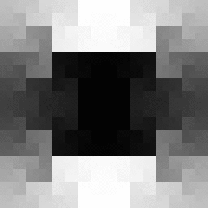
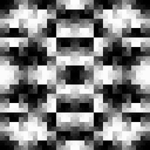

### Moore Vision   
A method for encoding visual data, reducing the dimensionality to a 1D representation with consistant data size and spatial representation by utilizing [Moore Curves](https://en.wikipedia.org/wiki/Moore_curve).    
    
    
   
Properties of Moore Curves allow the resolution to be increased arbitrarily, with the same areas within the Focus mapping to the same relative position along the curve. In effect, this enables a consistant and dynamic representation of 2D image data in a 1D structure. Because of this, an extra dimension of time can be added, which brings it back up to a 2D representation, but this is still much simpler than a 3D representation of Image+Time. Additionally, a representation of the movement (Vertical, Horizontal, and Focus Size) can be easily represented and tacked on for additional context (Seen on the far right of the readout). The coordinates of the curve may be precomputed so in order to move and scale the Focus, it only requires adding to or multiplying a list of coordinates.        

The goal of this experiement is to see whether a machine learning model could be taught to "see" using this data embedding, as it would allow for a fundamentally different perception that I think is more similar to the way animals see the world, with a shifting gaze and adaptive focus. In my limited knowledge on the topic, using a Transformer-like network architecture seems to be the right direction to head in.  

From a high-level view, I imagine a system that would be able to build up it's confidence in what it's looking at by looking around and looking closer at certain details of the image, and this would all be able to be represented without changing the size of the input data stream. Notably, changing the resolution of the curve itself is what changes the size of the data stream (to 4^iterations points). However, looking around and changing the size of the Focus can be done without affecting the data stream, so I imagine a curve of 5 or 6 iterations (1024 or 4096 points) would be ideal to train a model for preliminary results.    
      
The reconstruction image window represents the level of detail being "perceived" by the focus. The image is created by reading the last 1D memory frame, and uses those colors in combination with its list of curve coordinates to paint a reconstruction. The main purpose of this is to make the system more human inspectable, not to be used for learning.   
    
#### Frequency Filtering
 
    
[Here's a video demonstrating various simple frequency filters](https://www.youtube.com/watch?v=e9KUrNSeHEs)   
Frequency filtering has been added! Because the Moore curve has a cyclical property, you can specify 1D filters that remove parts of the curve based on different frequencies, and modified by different angular offsets and gain values. They can also be binarized and inverted easily. Additionally, it's trivial to add these frequency filters together, and compose an arbitrary number of them. Just as any function can be decomposed into fundamental frequencies, it seems you could build an arbitrary function using these frequency filters to remove arbitrary areas within the input data which could be built up to fill the role of traditional convolutions for detecting shapes and patterns. Another interesting feature of the Moore Curve is that when the resolution is changed, the region removed by a given filter stays constant. This is one, fairly straightforward way of introducting 1D filtering over the input data, but I'm sure there are countless other interesting and creative ways to do it.     

### To run    
Simply run the VisionBeta.py script.
> python VisionBeta.py  

### Controls
1,2 - Cycle through loaded images. (By default there's a few)     
W,A,S,D - Will move the Focus around within the image.   
R,F - Change the size of the Focus.   
T,G - Change the number of iterations (Resolution) of the Moore Curve.  

E - Toggle whether the Focus follows the mouse around the image.   
Q - Toggle whether to readout the entire memory, or only instantaneous.   
P - Toggle whether to draw the curve (makes loop time faster on higher iterations).    

###### Filter Controls (Bottom Letter Row)    
NOTE: The demo is initiallized with a filter composed of adding a F=1 and F=6 together, however there is no easy way of creating compositions in the demo, so only simple frequency filters can be explored.          
Z - Toggle filtering on/off     
X,C - Lower/Raise the Frequency being filtered    
V,B - Lower/Raise the angular degree offset of the filter   
N,M - Lower/Raise Filter gain  
, - Toggle binarization of filter    
. - Toggle filter inversion      
/ - Cycle through 360 degree offsets

` - Exit the program.  
