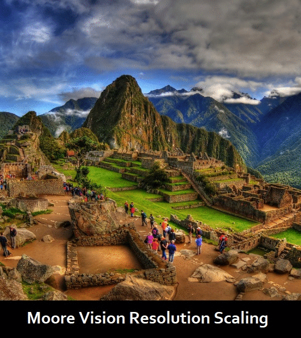

### Moore Vision    

A framework for reducing the dimensionality of the vision problem by utilizing Moore Curves. Properties of Moore Curves allow the resolution to be increased arbitrarily, with the same areas within the Focus mapping to the same relative position along the curve. In effect, this enables a consistant and dynamic representation of 2D image data in a 1D structure. Because of this, an extra dimension of time can be added, which brings it back up to a 2D representation, but this is still much simpler than a 3D representation of Image+Time. Additionally, a representation of the movement (Vertical, Horizontal, and Focus Size) can be easily represented and tacked on for additional context (Seen on the far right of the readout).        

The goal of this experiement is to see whether a machine learning model could be taught to "see" using this data stream, as it would allow for a fundamentally different perception that I think is more similar to the way animals see the world, with a shifting gaze and adaptive focus.  

The newly added reconstruction image represents the level of detail being "perceived" by the focus. The image is created by reading the last 1D memory frame, and uses those colors in combination with its list of curve coordinates to paint a reconstruction. The main purpose of this is to make the system more human inspectable, not to be used for learning.   

Frequency filtering has been added! Because the Moore curve has a cyclical property to it, I had a hunch that using filters based on frequency would yield an interesting result, and it did! In this case, Frequency filtering would be the equivalent of convolutional filters for traditional neural nets.     

### To run    
Simply run the VisionBeta.py script.
> python VisionBeta.py  

### Controls
1,2 - Cycle through loaded images. (By default there's a few)     
W,A,S,D - Will move the Focus around within the image.   
R,F - Change the size of the Focus.   
T,G - Change the number of iterations (Resolution) of the Moore Curve.  

E - Toggle whether the Focus follows the mouse around the image.   
Q - Toggle whether to readout the entire memory, or only instantaneous.   
P - Toggle whether to draw the curve (makes loop time faster on higher iterations).    

###### Filter Controls (Bottom Letter Row)        
Z - Toggle filtering on/off    
X - Toggle binarization of filter    
C,V - Lower/Raise the Frequency being filtered    
B,N - Lower/Raise the angular degree offset of the filter   
M/, - Lower/Raise Filter gain    
. -  Toggle filter inversion

` - Exit the program.  
